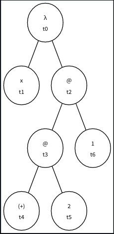
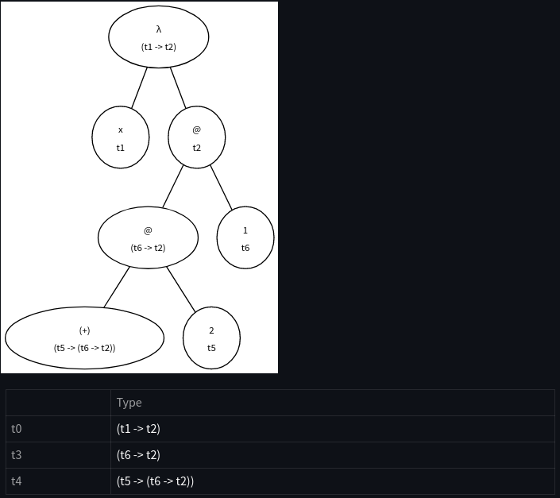
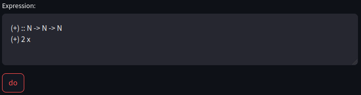
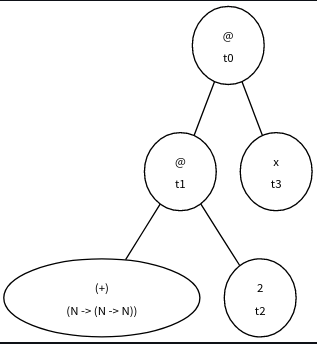
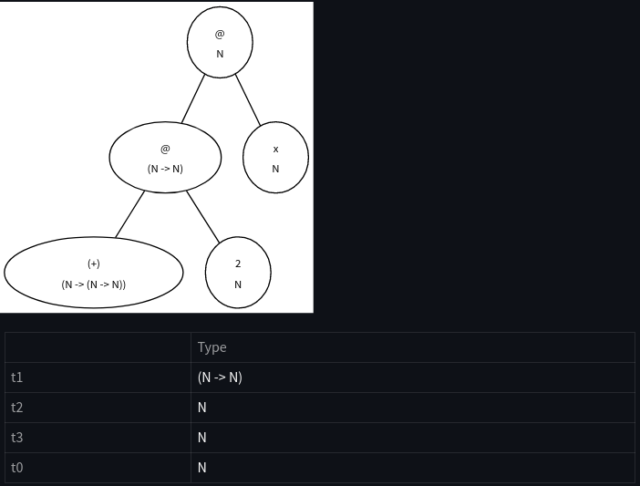

<h1>HinNer Analyser</h1>

The following code makes inferences about the type of a simplified version of Haskell expressions using ANTLR. Here are some exemples of the types of expressions accepted and its results:

<h3>Example 1:</h3>

In this example it is used only one expression.

Following is the tree previous to applying the inference algorithm.

This is the result with the infered types:

<h3>Example 2:</h3>

Some definitions will be added previous to the expression.

<h2>Installation</h2>

Execute the file named installSetup.sh

<h2>Execution</h2>

Execute the file named execute.sh

<h2>Things to avoid and take into account before executing the program</h2>
<h3>Avoid</h3>
<ul>
    <li>Leave empty lines, they will be detected as syntaxis errors as the interpreter will detect them as errors, because it won't find the EOF.</li>
    <li>Put more than one expression or definition in the same line of the textarea.</li>
</ul>
<h3>Take into account</h3>
<ul>
    <li>You can place multiple expressions and/or definitions at the same time in the textarea, however, they will be executed sequentially.</li>
    <li>
        Defined types must be written in uppercase.
    </li>
</ul>
<h2>Instruction of use</h2>
<ol>
    <li>Add an statement (definition or expression) per line in the textarea.</li>
    <li>Click the button "do".</li>
</ol>

<h2>References</h2>

The inference mecanism was created adapting the code about unfication equations that can be find in the following blog:

https://eli.thegreenplace.net/2018/unification/   